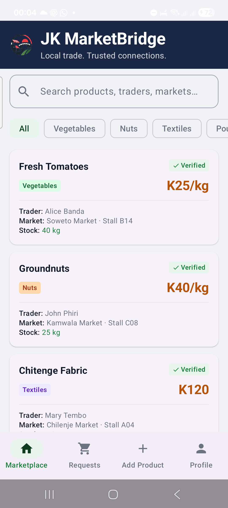
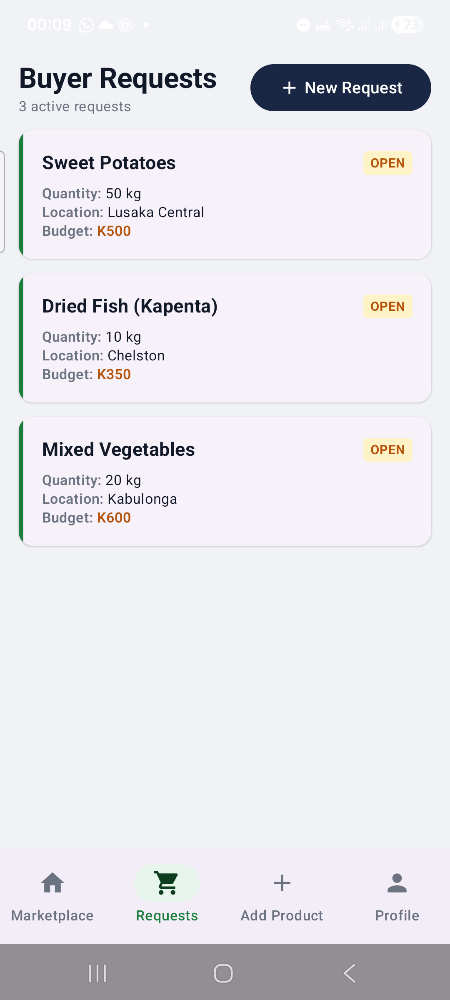
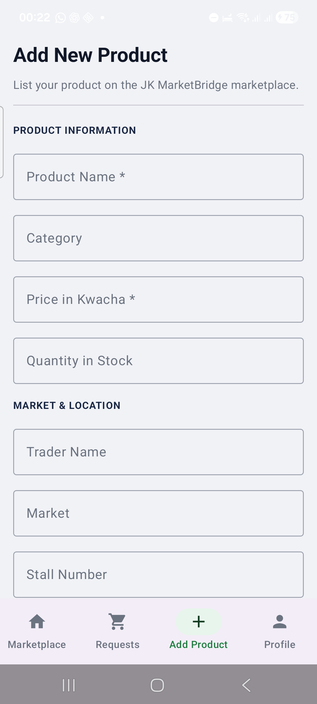
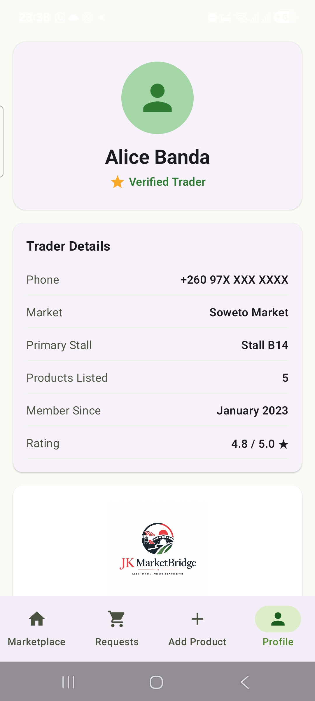

# JK MarketBridge

> **Local trade. Trusted connections.**

An offline-first Android application that connects buyers and traders across Zambia's local markets. Built with Jetpack Compose and Material 3, with an enterprise-grade trade marketplace UI.

---

## Screenshots

| Marketplace | Buyer Requests | Add Product | Trader Profile |
|:-----------:|:--------------:|:-----------:|:--------------:|
|  |  |  |  |

---

## Features

### Marketplace
- Deep-navy header with app logo emblem and tagline
- Scrollable product cards — name, colour-coded category badge, Kwacha price in amber, trader, market, stall and stock quantity
- Live search across product names, traders and markets
- Category filter chips (Vegetables, Nuts, Textiles, Poultry, Grains…)
- Tap any card to open a full product detail dialog
- Reserve a product for collection — generates a unique 4-digit collection code

### Buyer Requests
- Pre-loaded sample requests from buyers across Lusaka
- Cards with a green left-accent bar and an amber **OPEN** status badge
- Add new requests with product, quantity, delivery location and maximum budget
- Submissions appear instantly in the list without any page reload

### Add Product
- Sectioned form: **Product Information** and **Market & Location**
- Seven fields: name, category, price in Kwacha, quantity, trader, market and stall
- Required-field validation with inline error messages
- New products are immediately visible in the Marketplace tab

### Trader Profile
- Navy header card with avatar, name and Verified Trader pill
- Stats row: product count · 4.8 ★ rating · member since year
- Trader details card (phone, market, stall, member since)
- Brand identity card with full app logo
- "Why Verification Matters" explanation card

---

## UI Design

The application uses a professional enterprise trade marketplace palette:

| Role | Colour | Hex |
|---|---|---|
| Primary (header, nav) | Deep Navy | `#1A2744` |
| Secondary (verified, stock) | Verified Green | `#1B7E3D` |
| Tertiary (prices, CTAs) | Trade Amber | `#B45309` |
| Background | Cool Gray | `#F0F2F5` |

Category badges are colour-coded per type (green for Vegetables, amber for Grains, orange for Nuts, purple for Textiles, blue for Poultry).

---

## Tech Stack

| Layer | Choice |
|---|---|
| Language | Kotlin 2.2.10 |
| UI | Jetpack Compose + Material 3 |
| State | `mutableStateListOf` / `mutableStateOf` (no ViewModel) |
| Navigation | Tab state (`when` on `selectedTab`) |
| Data | In-memory — no database, no network |
| Build | Android Gradle Plugin 9.3.0 |
| Compose BOM | 2026.02.01 |
| Min SDK | 24 (Android 7.0) |
| Target SDK | 36 |

No Firebase, Room, Retrofit, or any external service is used. The app works completely offline.

---

## Project Structure

```
app/src/main/java/zm/edu/justinkabwe/jkmarketbridge/
├── MainActivity.kt          # All screens, composables and data models
└── ui/theme/
    ├── Color.kt             # Enterprise trade marketplace palette
    ├── Theme.kt             # Material 3 light colour scheme
    └── Type.kt              # Typography
```

---

## Getting Started

### Prerequisites
- Android Studio Ladybug or later
- JDK 11
- Android SDK 36

### Build & Run

```bash
# Clone the repository
git clone https://github.com/BRICIOU/JKMarketBridge.git
cd JKMarketBridge

# Build debug APK
./gradlew assembleDebug

# Install on connected device
adb install app/build/outputs/apk/debug/app-debug.apk
```

The APK is output to `app/build/outputs/apk/debug/app-debug.apk`.

---

## Sample Data

Five products are pre-loaded at startup:

| Product | Category | Price | Market | Stall | Stock |
|---|---|---|---|---|---|
| Fresh Tomatoes | Vegetables | K25/kg | Soweto Market | B14 | 40 kg |
| Groundnuts | Nuts | K40/kg | Kamwala Market | C08 | 25 kg |
| Chitenge Fabric | Textiles | K120 | Chilenje Market | A04 | 16 items |
| Fresh Eggs | Poultry | K65/tray | Matero Market | D11 | 20 trays |
| Maize | Grains | K180/50kg bag | Soweto Market | F03 | 30 bags |

Three buyer requests are pre-loaded (Sweet Potatoes, Dried Fish/Kapenta, Mixed Vegetables).

---

## Package

```
zm.edu.justinkabwe.jkmarketbridge
```

---

## Author

**Martin Chirwa** — Grade 11, Justin Kabwe Secondary School, Mandevu, Lusaka, Zambia

98th Agricultural and Commercial Show — Design and Technology Competition
Category: ICT and Smart Technologies | Theme: Fostering Trade and Investment | July 2026

---

## License

This project was built for the 98th ACSZ Agricultural and Commercial Show Design and Technology Competition by a Grade 11 learner at Justin Kabwe Secondary School, Lusaka. Free to use for educational purposes.